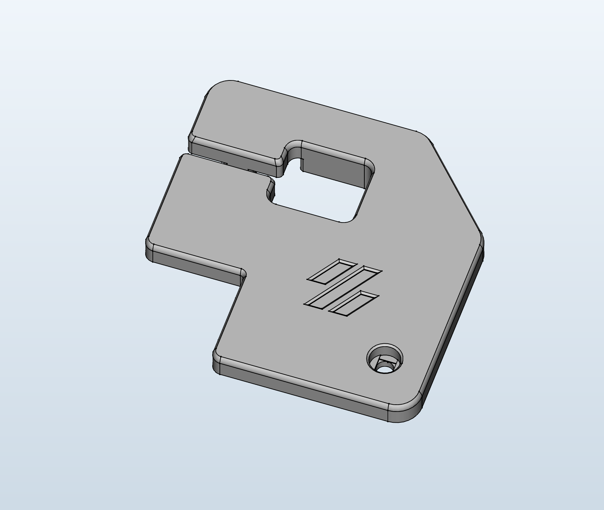
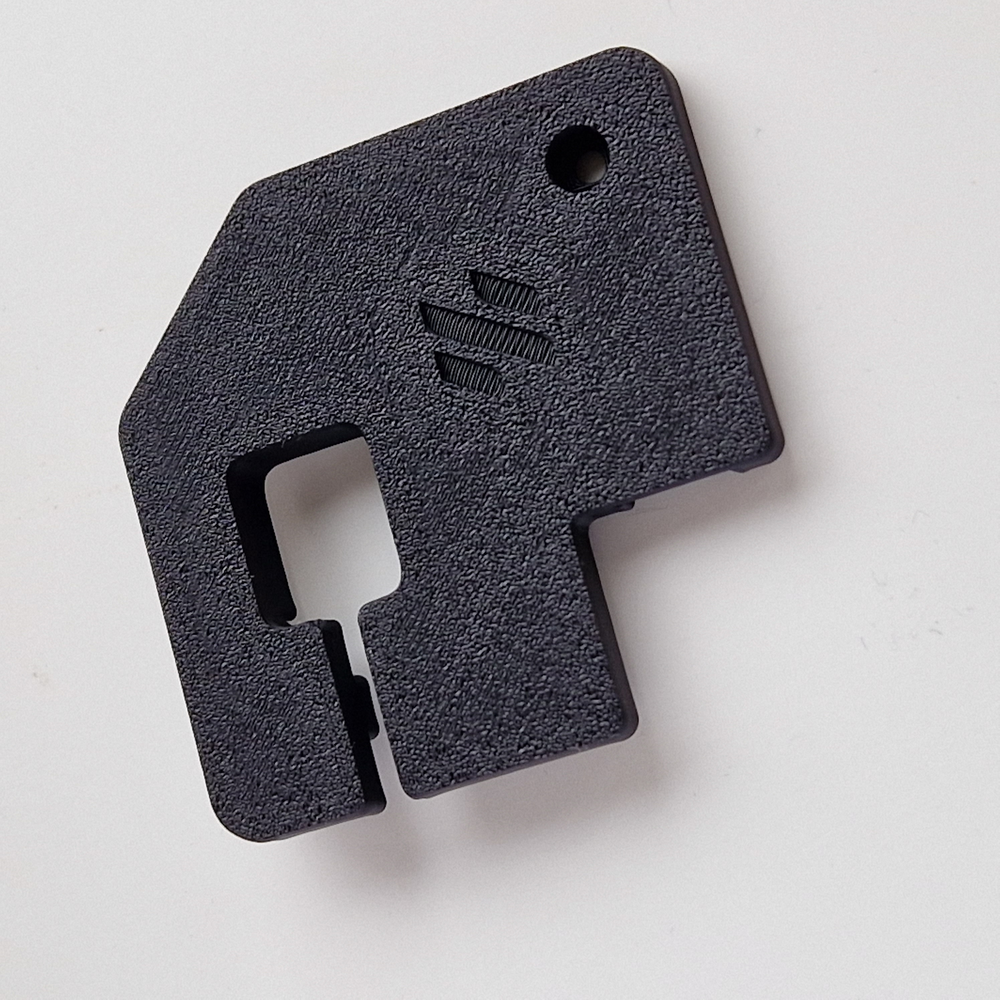
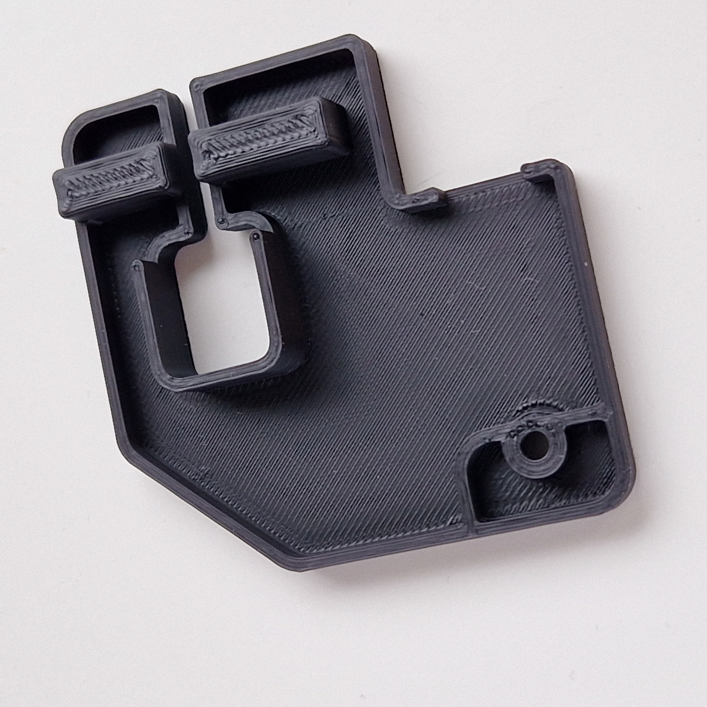
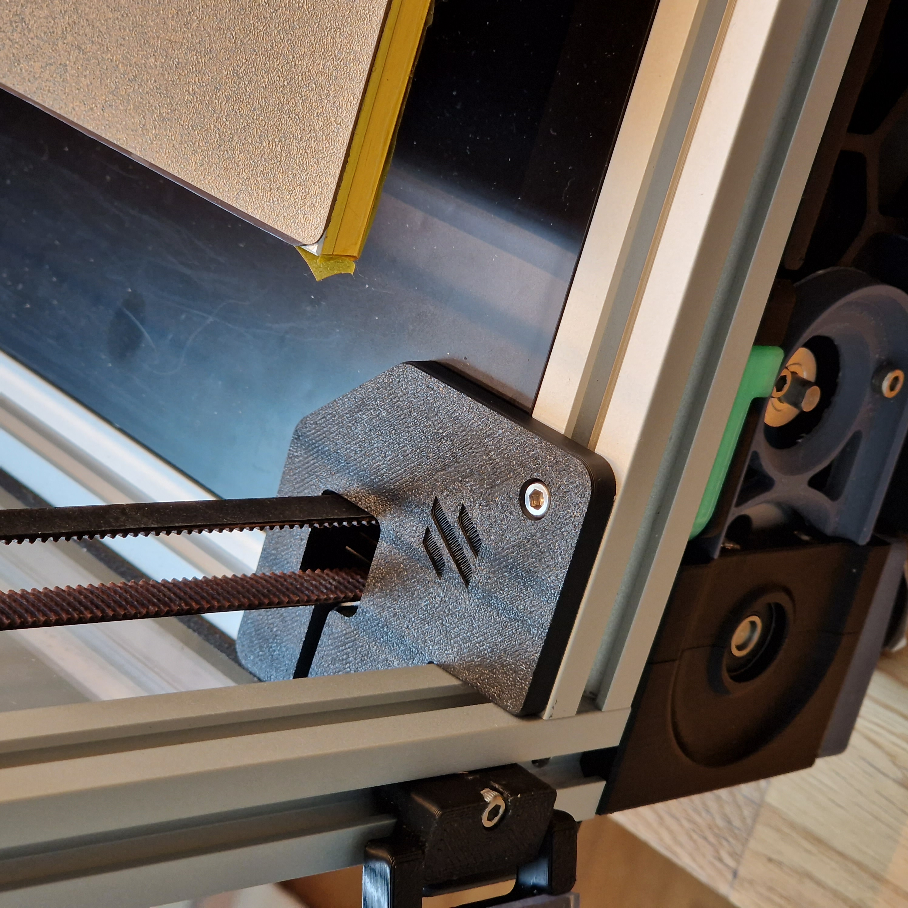

# Voron 2.4 Z belt cover mod with cable routing
## Credit
[Voron team](https://github.com/VoronDesign/) 
[Akio](https://github.com/Akio-42)

## Print settings
Print according to official Voron [print settings](https://docs.vorondesign.com/sourcing.html#print-settings).

## Bom
* 4x M3x8 SHCS
* 4x hammerhead t-nut

## Description
This mod is a combiniation of the official Voron 2.4 and Voron 2.2 z belt covers. It also incorporates the hidden cable routing from the [hidden cable routing z belt cover mod](https://github.com/VoronDesign/VoronUsers/tree/master/printer_mods/Akio/cable_routing_z_belt_cover) by Akio.

* There are two versions of the covers. One with and one without the Voron logo.
* The covers are 5 mm tall so you need a gap of at least 5 mm between the z-rails and the extrusions for this cover to fit.
* Please take care when routing the cables in the electronics bay to make sure they do not rub against the belts.

## Pictures
Logo version:

&nbsp; 

Plain version:

&nbsp; 

Printed parts:

&nbsp; 

Installed into machine:

